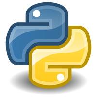

# Проект автотестов для https://reqres.in/

## Проект совмещает UI + API  тесты
* UI + API тесты
    * ✅ Регистрация пользователя
    * ✅ Авторизация пользователя
    * ✅ Ошибка авторизации - не введен пароль
    * ✅ Отображение ресурса
    * ✅ Отсутствие пользователя
* API тесты
    * ✅ Соответствие номера страницы запрашивамой 
    * ✅ Количество пользователей на странице
    * ✅ Валидация схемы ответа
    * ✅ Проверка доступности нескольких страниц (Параметризацованный тест)


## Применнные технологии
<p  align="center">
  <code></code>
  <code></code>
  <code></code>
  <code></code>
  <code></code>
  <code></code>
  <code></code>
  <code></code>
  <code></code>
  <code></code>
</p>


## Запуск тестов
### Локально
Склонировать проект. Через консоль в папке проекта выполнить команду:
```
pytest
```

### Удаленно
```bash
rm -rf allure-results/*
python -m venv .venv
source .venv/bin/activate
pip install -r requirements.txt
pytest . --alluredir=allure-results
```

##  Запуск тестов из [Jenkins](https://jenkins.autotests.cloud/job/qa_guru_python_4_25/)
Запуск тестов из Jenkins:
Добавить проект в Jenkins и нажать кнопку "Собрать сейчас".

<p></p>

Нажать на иконку Allure возле завершившегося процесса для просмотра отчета

<p></p>


###  [Allure](https://jenkins.autotests.cloud/job/lastfm_graduate_work_qa_quru_ui/100/allure/)

#### Примеры отчетов


###  Telegram

#### Настроена отправка отчета в Telegram


## Пример видео тестового прогона

В отчетах Allure для каждого UI-теста прикреплен не только скриншот, но и видео прохождения теста

<p align="center">
  
</p>